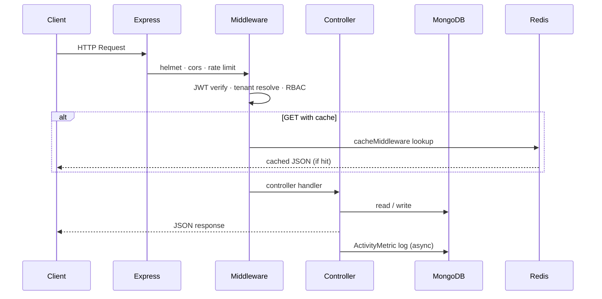

# AccessPro RBAC — Multi-Tenant SaaS Backend

Backend API for multi-tenant **Role-Based Access Control (RBAC)**, user & project management, Stripe subscriptions, activity audit logs, KPI metrics, email notifications, Redis caching, and automated testing with GitHub Actions CI/CD.

Built to demonstrate real-world backend engineering for production-style SaaS applications.

---

## Table of Contents

- [Project Overview](#project-overview)
- [Highlights](#highlights)
- [Key Features](#key-features)
- [Architecture Legend](#architecture-legend)
- [Architecture Diagram](#architecture-diagram)
- [Request Flow (Under the Hood)](#request-flow-under-the-hood)
- [Tech Stack](#tech-stack)
- [Project Structure](#project-structure)
- [Data Models](#data-models)
- [Roles & Permissions](#roles--permissions)
- [User Onboarding](#user-onboarding)
- [Multi-Tenant Design](#multi-tenant-design)
- [Authentication & Authorization](#authentication--authorization)
- [Subscription & Billing](#subscription--billing)
- [Caching & Performance](#caching--performance)
- [Analytics & Metrics](#analytics--metrics)
- [Notifications](#notifications)
- [Security Enhancements](#security-enhancements)
- [API Reference](#api-reference)
- [Audit Log Query Examples](#audit-log-query-examples)
- [Environment Variables](#environment-variables)
- [Setup & Installation](#setup--installation)
- [Testing & CI/CD](#testing--cicd)
- [Deployment](#deployment)
- [API Documentation](#api-documentation)
- [Contributing](#contributing)
- [License](#license)

---

## Project Overview

AccessPro RBAC is a multi-tenant SaaS backend that lets companies register as isolated tenants, manage users and projects under RBAC, subscribe to paid plans via Stripe, and track all API activity through audit logs and KPI metrics.

Each tenant gets:

- A unique **domain** (used for `x-tenant` header / subdomain routing)
- Default roles: **owner**, **admin**, **employee**
- Scoped data in MongoDB (`tenantId` on users, projects, roles, invites, metrics)

**Entry points**

| File | Purpose |
|------|---------|
| `server.js` | Connects to MongoDB and starts the HTTP server |
| `app.js` | Express app, middleware stack, route mounting, Swagger |

**Health check:** `GET /` → welcome JSON message

---

## Highlights

- Multi-tenancy with tenant isolation at API and database level
- Role-Based Access Control with per-tenant permission documents
- Stripe billing with Free / Pro / Enterprise plans and webhook handling
- Analytics: tenant KPIs, admin system KPIs, request-per-day charts
- Audit logs with pagination, filtering, and CSV export (plan-gated)
- Email notifications for invites, password reset, and billing events
- Redis caching with TTL and explicit invalidation on writes
- API rate limiting: global, per-plan tenant, login, and password reset
- Two-factor authentication (TOTP) for owner and admin
- Jest unit + integration tests with `mongodb-memory-server`
- GitHub Actions CI/CD: automated tests + SSH deploy with PM2 on `main`
- OpenAPI (Swagger) docs and Postman collection

---

## Key Features

| Area | What is implemented |
|------|---------------------|
| Multi-tenancy | `x-tenant` header + subdomain detection; cross-tenant access blocked |
| Onboarding | Tenant registration, invite-by-email, or direct API user creation |
| RBAC | Dynamic roles in MongoDB; `authorize()` middleware enforces permissions |
| Projects | CRUD, soft delete/restore, employee assignment, role-based visibility |
| Billing | Stripe Checkout, subscriptions, one-time Enterprise payment, refunds |
| Soft delete | Mongoose plugin on User, Tenant, Project; restore endpoints |
| Caching | Redis on users, projects, tenants, KPI metrics |
| Rate limits | Global daily cap + plan-based tenant limits + auth-specific limits |
| Audit | `ActivityMetric` collection + `TenantAuditLog` for tenant profile changes |
| 2FA | speakeasy TOTP + QR code for owner/admin |
| Docs | Swagger UI at `/api-docs`; Postman collection in `postman/` |

---

## Architecture Legend

| Layer | Responsibility |
|-------|----------------|
| **Clients** | Frontend apps, Postman, or any HTTP API consumer |
| **API Gateway** | Express.js server (`app.js`) — routing, parsers, security headers |
| **Middleware** | Auth (JWT), RBAC, tenant resolution, plan limits, caching, rate limits, activity logging |
| **Controllers / Services** | Business logic: users, tenants, projects, billing, invites, metrics, 2FA |
| **MongoDB** | Persistent multi-tenant data (users, tenants, roles, projects, invites, metrics, audit) |
| **Redis** | Response cache for high-frequency GET endpoints |
| **External services** | Stripe (payments), SMTP via Nodemailer (email), Hunter.io (invite email verification) |

---

## Architecture Diagram

```text
┌──────────────────────┐
│ Client               │
│ (Frontend / Postman) │
└──────────┬───────────┘
           │
           ▼
┌───────────────────────┐
│ API Gateway           │
│ Express.js (app.js)   │
└──────────┬────────────┘
           │
┌──────────▼────────────────────────────┐
│ Middleware Layer                      │
│ ┌───────────────────────────────────┐ │
│ │ JWT Auth + Token Blacklist        │ │
│ │ RBAC Authorization                │ │
│ │ Tenant Subdomain / x-tenant       │ │
│ │ attachTenant (cross-tenant guard) │ │
│ │ Redis Caching                     │ │
│ │ Plan Restriction + User Limits    │ │
│ │ Rate Limiting (global + tenant)   │ │
│ │ Activity / Audit Logging          │ │
│ │ Stripe Raw Body (webhook route)   │ │
│ └───────────────────────────────────┘ │
└──────────┬────────────────────────────┘
           │
┌──────────▼────────────────────────────┐
│ Controllers / Services                │
│ ┌───────────────────────────────────┐ │
│ │ Auth & 2FA                        │ │
│ │ Users & Invites                   │ │
│ │ Tenants & Admin                   │ │
│ │ Projects                          │ │
│ │ Billing (Stripe)                  │ │
│ │ Audit & Metrics                   │ │
│ │ Notifications (email)             │ │
│ └───────────────────────────────────┘ │
└──────────┬────────────────────────────┘
           │
┌──────────▼──────────┐     ┌─────────────────┐
│ MongoDB             │     │ Redis           │
│ (tenant-scoped data)│     │ (response cache)│
└──────────┬──────────┘     └─────────────────┘
           │
┌──────────▼──────────────────────────┐
│ External Services                   │
│ Stripe · SMTP (Nodemailer) · Hunter │
└─────────────────────────────────────┘
```



---

## Request Flow (Under the Hood)

### Typical authenticated, tenant-scoped request

```http
GET /api/users/getUsers
Authorization: Bearer <accessToken>
x-tenant: <tenant-domain>
```

1. **`appRateLimiter`** — global (10,000/day) then plan-based tenant limiter
2. **`protect`** — verify JWT, reject blacklisted tokens, attach `req.user` and `req.tenant`
3. **`tenantSubDomainMiddleware`** — resolve tenant from `x-tenant` header or `req.subdomains[0]`
4. **`attachTenant`** — ensure `req.user.tenantId` matches resolved tenant (blocks cross-tenant access)
5. **`authorize([...])`** — load role permissions from `Roles` collection; prefix-match required permissions
6. **`cacheMiddleware`** (GET only) — return Redis cached response or store result with TTL
7. **Controller** — business logic
8. **`withActivityLog`** — writes success/failure to `ActivityMetric` (passwords/tokens redacted in metadata)

### Registration flow (`POST /register`)

1. Validate required fields: `name`, `email`, `password`, `companyName`, `domain`
2. Enforce password policy
3. Create `Tenant` document
4. Seed default roles via `createDefaultRoles(tenantId)`
5. Create first user with role **`owner`**

### Login flow (`POST /login`)

1. Resolve tenant by `companyName`
2. Validate credentials; track failed attempts
3. Lock account **15 minutes** after **5** failed attempts
4. If owner/admin has `twoFactor.enabled` → return `userId` for OTP step
5. Else return `accessToken` + `refreshToken` (permissions embedded in access token)

### Token refresh (`POST /refresh`)

Send `{ "refreshToken": "..." }` → receive new `accessToken` + `permissions`.

### Logout (`POST /logout`)

Adds JWT to `BlackListedTokens` collection until token expiry.

---

## Tech Stack

| Layer | Technology |
|-------|------------|
| Runtime | Node.js 18+ |
| Framework | Express 5 |
| Database | MongoDB (Mongoose 8) |
| Cache | Redis 5 |
| Auth | JWT (`jsonwebtoken`), bcrypt |
| 2FA | speakeasy + qrcode (TOTP) |
| Payments | Stripe |
| Email | Nodemailer (HTML templates) |
| Email verification | Hunter.io API (invite flow) |
| CSV export | json2csv |
| API docs | swagger-jsdoc + swagger-ui-express (OpenAPI 3.0) |
| Testing | Jest 30, Supertest, mongodb-memory-server |
| CI/CD | GitHub Actions, SSH deploy, PM2 |

---

## Project Structure

```text
02_AccessPro_RBAC/
├── app.js                          # Express setup, middleware, routes
├── server.js                       # DB connect + listen
├── config/
│   ├── database.js                 # Mongoose connection
│   ├── redisClient.js              # Redis client (disabled in test)
│   ├── stripe.js                   # Stripe SDK init
│   └── env.js                      # isTest flag
├── controllers/
│   ├── 2FA/                        # setup, verify-setup, verify-login
│   ├── metricsControllers/         # tenant + admin KPIs
│   ├── authController.js
│   ├── userActionControllers.js
│   ├── userInviteController.js
│   ├── projectControllers.js
│   ├── tenantController.js
│   ├── stripeControllers.js
│   ├── auditController.js
│   └── activityLogger.js
├── middlewares/
│   ├── authentication.js           # JWT + blacklist
│   ├── authorize.js                # RBAC
│   ├── attachTenant.js             # cross-tenant guard
│   ├── tenantSubDomain.js          # x-tenant / subdomain
│   ├── cache.js                    # Redis cache + invalidation
│   ├── planRestriction.js          # plan-gated features
│   ├── restrictByUserLimit.js      # per-plan user caps
│   ├── controllerLogger.js         # audit wrapper for controllers
│   ├── stripeHandlers.js           # refund helpers + invoice emails
│   ├── errorHandler.js
│   └── rateLimiter/                # app, tenant, login, password reset
├── models/
│   ├── User.js, Tenant.js, Roles.js
│   ├── Project.js, Invite.js
│   ├── activityMetric.js           # API activity / audit logs
│   ├── tenantAuditLog.js           # tenant profile change history
│   └── blackListedToken.js
├── plugins/softDelete.js
├── routes/                         # 9 route modules
├── script/
│   ├── webhookHandlerRoute.js      # Stripe webhook handler
│   └── cancelSubscription.js       # CLI helper script
├── services/metricsServices.js
├── swagger/
│   ├── swaggerMain/                # OpenAPI setup
│   └── roots/                      # Per-domain Swagger definitions
├── utils/
│   ├── generateTokens.js           # access, refresh, invite tokens
│   ├── passwordPolicy.js
│   ├── checkEmailExists.js         # Hunter.io
│   ├── notificationService.js
│   ├── htmltemplates/              # invite + password reset emails
│   └── kpiChacheKeys.js
├── tests/                          # unit + integration
├── postman/AccessPro_RBAC.postman_collection.json
└── .github/workflows/ci-cd.yml
```

---

## Data Models

| Model | Purpose |
|-------|---------|
| `Tenant` | Company record: name, domain, email, subscription, logo, status |
| `User` | Tenant user: role, 2FA, login lockout, soft delete |
| `Roles` | Per-tenant role + permissions array |
| `Project` | Tenant project: assignees, createdBy, soft delete |
| `Invite` | Pending invite: email, role (`admin`/`employee`), token, expiry |
| `ActivityMetric` | API audit log + metrics source (actions, IP, metadata) |
| `TenantAuditLog` | Tenant profile update/deactivate history |
| `BlackListedToken` | Logged-out JWT tokens |

**Tenant subscription fields** (`Tenant.subscription`):

- `plan`: `Free` \| `Pro` \| `Enterprise`
- `status`: `active` \| `canceled` \| `trialing` \| `past_due` \| `incomplete`
- Stripe IDs: `stripeCustomerId`, `stripeSubscriptionId`, `stripePaymentIntentId`, `checkoutSessionId`
- Billing metadata: `currentPeriodEnd`, `defaultPaymentMethod`, `amountPaid`, refund tracking

---

## Roles & Permissions

Default roles are created per tenant in `utils/createDefaultroles.js`.

### Role summary

| Role | Description |
|------|-------------|
| **owner** | Full tenant control; only one owner per tenant |
| **admin** | Manage employees and projects; cannot create another admin or owner |
| **employee** | View and update assigned projects only |

### Permission matrix

| Permission | owner | admin | employee |
|------------|:-----:|:-----:|:--------:|
| `audit:view` | ✓ | ✓ | |
| `user:view` | ✓ | ✓ | |
| `user:update` | ✓ | ✓ | |
| `user:deactivated` | ✓ | ✓ | |
| `user:restored` | ✓ | ✓ | |
| `user:create:admin` | ✓ | | |
| `user:delete:admin` | ✓ | | |
| `user:create:employee` | ✓ | ✓ | |
| `user:delete:employee` | ✓ | ✓ | |
| `tenant:view` | ✓ | ✓ | |
| `tenant:update` | ✓ | ✓ | |
| `tenant:deactivated` | ✓ | ✓ | |
| `tenant:restored` | ✓ | ✓ | |
| `project:create` | ✓ | ✓ | |
| `project:view` | ✓ | ✓ | ✓ |
| `project:update` | ✓ | ✓ | ✓ |
| `project:delete` | ✓ | ✓ | |
| `project:deactivated` | ✓ | ✓ | |
| `project:restored` | ✓ | ✓ | |

**User creation rules** (`POST /api/users/create`):

- Owner can create `admin` or `employee` (not another owner)
- Admin can create `employee` only
- Employee cannot create users

**Project visibility**:

- Owner/admin see all tenant projects
- Employee sees only projects where they are in `assignedTo`

**Role sync:** `POST /api/admin/sync-roles` — **owner only**; re-seeds default roles for all tenants.

---

## User Onboarding

Two supported paths:

### 1. Invite flow (recommended for team members)

1. `POST /inviteRoute/invite` — verifies email via Hunter.io, creates `Invite`, sends HTML email
2. Invitee calls `POST /inviteRoute/accept-invite` with `token`, `name`, `password`
3. User created with invited role (`admin` or `employee`)

### 2. Direct API creation

`POST /api/users/create` — authenticated owner/admin creates user with `name`, `email`, `password`, `role`.

Both paths respect **plan user limits** (`restrictByUserLimit` middleware).

---

## Multi-Tenant Design

- **Database isolation:** all tenant resources include `tenantId`
- **API isolation:** `attachTenant` blocks requests where JWT tenant ≠ resolved tenant
- **Tenant resolution:**
  - Primary: `x-tenant: <domain>` request header
  - Alternative: HTTP subdomain (`req.subdomains[0]`) — e.g. `company-name.accesspro.com`
- **Soft delete:** Users and projects support soft delete + restore; Mongoose `softDelete` plugin auto-filters `isDeleted: true` records
- **Tenant deactivation:** `PUT /tenants/:id/deactive` sets `status: inactive`; data retained for audit

---

## Authentication & Authorization

### Tokens

| Token | Purpose | Secret env var |
|-------|---------|----------------|
| Access token | API authorization (`Authorization: Bearer`) | `JWT_ACCESS_SECRET` |
| Refresh token | Issue new access token (`POST /refresh`) | `REFRESH_TOKEN_SECRET` |
| Invite token | Invite accept flow (7-day expiry) | `INVITE_TOKEN_SECRET` |

Access token payload includes: `userId`, `tenantId`, `role`, `companyName`, `permissions`.

### RBAC enforcement

- Permissions stored per tenant in `Roles` collection
- `authorize(["permission:prefix"])` uses prefix matching (`user:create:employee` matches `user:create`)
- Failed auth → `401`; missing permission → `403`

### Two-factor authentication (owner / admin only)

| Step | Endpoint | Description |
|------|----------|-------------|
| Setup | `POST /2fa/setup` | Returns QR code + manual TOTP secret |
| Enable | `POST /2fa/verify-setup` | Verify OTP; sets `twoFactor.enabled = true` |
| Login | `POST /2fa/verify-login` | After login challenge, verify OTP; returns tokens |

---

## Subscription & Billing

### Plans

| Plan | Billing model | User limit |
|------|---------------|------------|
| **Free** | No Stripe price; activates on subscribe | 5 active users |
| **Pro** | Recurring Stripe subscription | 10 active users |
| **Enterprise** | One-time Stripe Checkout payment | Unlimited |

### Subscribe flow (`POST /api/billing/subscribe`)

Body: `{ "plan": "Pro", "paymentMethodId": "pm_...", "email": "optional" }`

1. Creates/retrieves Stripe customer
2. Without `paymentMethodId` → returns Stripe Checkout URL (setup mode) to save card
3. With `paymentMethodId` → attaches card, then:
   - **Free** → activates immediately
   - **Pro** → creates Stripe subscription (confirmed via webhook)
   - **Enterprise** → creates one-time Checkout session

### Other billing endpoints

| Endpoint | Purpose |
|----------|---------|
| `GET /api/billing/check-subscription` | Compare DB vs Stripe subscription state |
| `POST /api/billing/cancel-subscription` | Cancel Pro subscription or refund Enterprise |
| `GET /api/billing/stripe-success` | Post-checkout success handler (`?session_id=`) |
| `POST /billing/webhook` | Stripe webhook (raw body, signature verified) |

### Stripe webhook events handled

- `checkout.session.completed`
- `invoice.payment_succeeded` / `invoice_payment.paid`
- `invoice.payment_failed`
- `customer.subscription.updated` / `customer.subscription.deleted`
- `charge.refunded`

Includes **idempotency guards** (`lastInvoiceIdSent`, `lastPaymentIntentIdSent`) to prevent duplicate processing.

### Plan-gated features

- **Audit CSV export** (`GET /audit/export`) — Pro and Enterprise only (`restrictByPlan`)

---

## Caching & Performance

Redis caches GET responses via `cacheMiddleware`. Writes call `invalidateCache()`.

| Cache key pattern | Route | TTL |
|-------------------|-------|-----|
| `users:tenantId:<id>` | `GET /api/users/getUsers`, `GET /inviteRoute/getUsers` | 300s / 200s |
| `projects:tenantId:<id>` | `GET /projects/getProjects` | 60s |
| `tenants:all` | `GET /tenants` | 300s |
| `tenant:<id>` | `GET /tenants/:id` | 600s |
| `kpi:tenant:<id>:...` | `GET /api/metrics/tenant` | 10s |
| `kpi:admin:system` | `GET /api/metrics/admin` | 10s |

**Invalidation triggers:** user create/update/delete, project CRUD, invite accept, tenant update/deactivate.

**Rate limiting:**

| Limiter | Scope | Limit |
|---------|-------|-------|
| Global | All routes | 10,000 / 24 hours |
| Tenant (plan-based) | All routes | Free: 100 · Pro: 1,000 · Enterprise: 5,000 per window |
| Login | `POST /login`, `POST /2fa/verify-login` | 5 / minute per IP + company |
| Password reset | `POST /password-reset` | 5 / hour per IP + company |

> Redis is required for caching in non-test environments. Tests use `NODE_ENV=test` (in-memory MongoDB; Redis client not initialized).

---

## Analytics & Metrics

### Tenant metrics — `GET /api/metrics/tenant`

Requires `audit:view` permission.

```json
{
  "tenantId": "...",
  "kpis": {
    "totalRequests": 120,
    "activeUsers": 4
  },
  "charts": {
    "requestsPerday": [
      { "_id": { "day": "2026-06-15" }, "requests": 18 }
    ]
  }
}
```

- `totalRequests` — count of `ActivityMetric` documents for tenant
- `activeUsers` — distinct users with activity in last 24 hours
- `requestsPerday` — 7-day aggregation via MongoDB pipeline

### Admin metrics — `GET /api/metrics/admin`

Requires `audit:view` permission.

```json
{
  "systemKPIs": {
    "totalRequests": 5000,
    "totalUsers": 42,
    "totalTenants": 8
  }
}
```

### Metrics export — `GET /api/metrics/export`

Exports matching audit log data as CSV (same export logic as audit).

---

## Notifications

Centralized through `NotificationService` (`utils/notificationService.js`).

### Email (Nodemailer + HTML templates)

| Event | Trigger | Template |
|-------|---------|----------|
| Invite | `POST /inviteRoute/invite` | `utils/htmltemplates/sendEmail.js` |
| Password reset | `POST /password-reset` | `utils/htmltemplates/sendPasswordResetEmail.js` |
| Subscription invoice | Stripe webhook / checkout success | `middlewares/stripeHandlers.js` |
| Plan activated | Free plan subscribe | via `sendInvoice` |
| Subscription cancelled | Cancel / webhook | cancellation email with refund info |
| Payment failed | `invoice.payment_failed` webhook | direct SMTP via `stripeEmail.js` |

Invite emails include both a frontend link (`FRONTEND_URL/accept-invite?token=`) and direct API curl example.

### Stripe webhooks (inbound)

`POST /billing/webhook` — mounted with `express.raw()` **before** JSON body parser in `app.js`.

> **Note:** `NotificationService` includes stub handlers for `push` and `webhook_event` (console logging only). Push notifications are not implemented as a delivery channel.

---

## Security Enhancements

- **Helmet** — security HTTP headers
- **CORS** — configured in `app.js`
- **JWT** — access + refresh tokens; blacklist on logout
- **RBAC** — tenant-scoped roles and granular permissions
- **Cross-tenant guard** — `attachTenant` middleware
- **Password policy** — min 8 chars; uppercase, lowercase, number, special character
- **Login lockout** — 5 failed attempts → 15-minute lock (`failedLoginAttempts`, `lockUntil`)
- **Rate limiting** — global, per-plan, login, password reset
- **2FA** — TOTP for owner/admin (speakeasy, 30-second window)
- **Stripe webhook verification** — signature check with `WEBHOOK_SIGNING_SECRET`
- **Audit trail** — all controller actions logged to `ActivityMetric`; sensitive fields redacted
- **Error handler** — stack traces hidden when `NODE_ENV=production`

---

## API Reference

> **Swagger UI:** `GET /api-docs`  
> **Postman:** `postman/AccessPro_RBAC.postman_collection.json`

### Required headers (tenant-scoped routes)

```http
Authorization: Bearer <accessToken>
x-tenant: <tenant-domain>
Content-Type: application/json
```

---

### 1. Auth & security

#### `POST /register`
Creates a new tenant and owner user.

```json
{
  "name": "John Doe",
  "email": "john@example.com",
  "password": "SecurePass123!",
  "companyName": "Acme Corp",
  "domain": "acme"
}
```

#### `POST /login`
Returns JWT tokens (or 2FA challenge for enabled owner/admin).

```json
{
  "email": "john@example.com",
  "password": "SecurePass123!",
  "companyName": "Acme Corp"
}
```

#### `POST /logout`
Invalidates active JWT (requires `Authorization` header).

#### `POST /refresh`
```json
{ "refreshToken": "<refresh-token>" }
```

#### `POST /password-reset`
```json
{
  "email": "john@example.com",
  "companyName": "Acme Corp",
  "newPassword": "NewSecurePass123!"
}
```

#### `POST /2fa/setup`
Starts TOTP setup; returns QR code (owner/admin only).

#### `POST /2fa/verify-setup`
```json
{ "token": "123456" }
```

#### `POST /2fa/verify-login`
```json
{
  "userId": "<user-id-from-login-response>",
  "token": "123456"
}
```

---

### 2. Users — `/api/users` (auth + `x-tenant`)

| Method | Path | Description |
|--------|------|-------------|
| POST | `/create` | Create user (`name`, `email`, `password`, `role`) |
| GET | `/getUsers` | List tenant users (RBAC + cached) |
| DELETE | `/delete/:id` | Permanently delete user |
| PUT | `/soft-delete/:id` | Soft delete user (`isDeleted`) |
| PUT | `/restore/:id` | Restore soft-deleted user |

---

### 3. Invites — `/inviteRoute`

| Method | Path | Description |
|--------|------|-------------|
| POST | `/invite` | Send invite email (`email`, `role`: `admin` or `employee`) |
| POST | `/accept-invite` | Accept invite (`token`, `name`, `password`) — public |
| GET | `/getUsers` | List users in tenant |
| PUT | `/:id` | Update user role or `isActive` |
| PUT | `/:id/deactive` | Deactivate user |

---

### 4. Tenants & admin

| Method | Path | Auth | Description |
|--------|------|------|-------------|
| GET | `/tenants` | Public | List all tenants (cached) |
| GET | `/tenants/:id` | Yes | Get single tenant |
| PUT | `/tenants/:id/update` | Yes | Update name, logo, domain, subscriptionPlan |
| PUT | `/tenants/:id/deactive` | Yes | Deactivate tenant |
| POST | `/api/admin/sync-roles` | Owner | Re-sync default roles for all tenants |

---

### 5. Projects — `/projects`

| Method | Path | Description |
|--------|------|-------------|
| GET | `/getProjects` | List projects (role-based visibility, cached) |
| POST | `/create` | Create project (`name`, `description`, `assignedTo[]`) |
| PUT | `/update/:id` | Update project fields |
| DELETE | `/delete/:id` | Hard delete |
| PUT | `/softDelete/:id` | Soft delete (archive) |
| PUT | `/restore/:id` | Restore archived project |

---

### 6. Audit logs — `/audit`

| Method | Path | Description |
|--------|------|-------------|
| GET | `/` | Paginated audit logs for tenant |
| GET | `/export` | CSV export (**Pro / Enterprise plans only**) |

---

### 7. Metrics — `/api/metrics`

| Method | Path | Description |
|--------|------|-------------|
| GET | `/tenant` | Tenant KPIs + request chart |
| GET | `/admin` | Platform-wide system KPIs |
| GET | `/export` | Export audit/metrics data as CSV |

---

### 8. Billing — `/api/billing`

| Method | Path | Description |
|--------|------|-------------|
| GET | `/check-subscription` | DB + Stripe subscription status |
| POST | `/subscribe` | Start/upgrade subscription (`plan`, `paymentMethodId`) |
| POST | `/cancel-subscription` | Cancel active subscription |
| GET | `/stripe-success` | Stripe checkout success callback |

### Stripe webhook

| Method | Path | Description |
|--------|------|-------------|
| POST | `/billing/webhook` | Stripe events (raw body) |

---

## Audit Log Query Examples

Base endpoint: `GET /audit` (requires auth + `x-tenant` + `audit:view`)

```http
# Page 1, 25 items (default limit)
GET /audit?page=1&limit=25

# Date range + pagination
GET /audit?from=2026-01-01T00:00:00Z&to=2026-01-09T23:59:59Z&page=2

# Filter by action and resource
GET /audit?action=CREATE_PROJECT&resource=Project

# Filter by user
GET /audit?userId=64f7b4567890abcdef123456
```

**Response shape:**

```json
{
  "total": 150,
  "page": 1,
  "limit": 25,
  "pages": 6,
  "logs": []
}
```

**CSV export:** `GET /audit/export` — same filters; requires Pro or Enterprise plan.

---

## Environment Variables

Create a `.env` file in the project root:

```env
# Server
PORT=5000
NODE_ENV=development

# Database
MONGO_URI=mongodb://127.0.0.1:27017/accesspro

# JWT
JWT_ACCESS_SECRET=your-access-secret
JWT_ACCESS_EXPIRES=15m
REFRESH_TOKEN_SECRET=your-refresh-secret
REFRESH_EXPIRES=7d
INVITE_TOKEN_SECRET=your-invite-secret

# URLs
FRONTEND_URL=http://localhost:3000
BACKEND_URL=http://localhost:5000
BACKEND_DEV_URL=http://localhost:5000
CLIENT_URL=http://localhost:5000

# SMTP (Nodemailer) — use port 587 for Gmail
SMTP_HOST=smtp.gmail.com
SMTP_PORT=587
SMTP_USER=your-email@gmail.com
SMTP_PASS=your-app-password

# Email verification (invites) — Hunter.io
HUNTER_API_KEY=your-hunter-api-key

# Stripe
STRIPE_SECRET_KEY=sk_test_...
WEBHOOK_SIGNING_SECRET=whsec_...
STRIPE_PRO_PRICE_ID=price_...
STRIPE_ENTERPRISE_PRICE_ID=price_...

# Redis caching
REDIS_HOST=127.0.0.1
REDIS_PORT=6379
REDIS_PASSWORD=

# Optional — script/cancelSubscription.js only
API_URL=http://localhost:5000
ADMIN_API_TOKEN=
```

> `TEMP_TOKEN_SECRET` / `TEMP_TOKEN_EXPIRES` appear in GitHub Actions secrets but are **not used** in application source code.

---

## Setup & Installation

### Prerequisites

- Node.js **18+**
- MongoDB
- Redis (for caching outside test mode)
- Stripe account (billing routes)
- SMTP credentials (invite + billing emails)
- Hunter.io API key (invite email verification)

### Steps

```bash
git clone https://github.com/basanta1-github/accessPro_RBAC_App.git
cd 02_AccessPro_RBAC
npm install
```

### Development

```bash
npm run dev
```

Runs `nodemon server.js`.

### Production start

```bash
npm start
```

Runs `node server.js`.

Server listens on `PORT` (default `5000`).

- **Swagger:** [http://localhost:5000/api-docs](http://localhost:5000/api-docs)
- **Postman:** import `postman/AccessPro_RBAC.postman_collection.json`

---

## Testing & CI/CD

### Run tests locally

```bash
npm test
```

Single file:

```bash
npm test tests/integration/auth.test.js
```

### Test stack

- **Jest** + **Supertest** for HTTP integration tests
- **mongodb-memory-server** — in-memory MongoDB (no external DB needed for tests)
- Redis disabled when `NODE_ENV=test`

### Test coverage areas

| Area | Test files |
|------|------------|
| Auth & login | `tests/integration/auth.test.js` |
| RBAC / users | `tests/integration/user.test.js` |
| Invites | `tests/integration/userInvite.test.js` |
| Tenants | `tests/integration/tenant.test.js` |
| Projects | `tests/integration/project.test.js` |
| Audit | `tests/integration/audit.test.js` |
| Admin / role sync | `tests/integration/admin.test.js` |
| Stripe webhooks | `tests/integration/webhook.test.js` |
| Password policy | `tests/unit/passwordpolicy.test.js` |
| Token generation | `tests/unit/generateToken.test.js` |
| Default roles | `tests/unit/createDefaultRoles.test.js` |
| Soft delete plugin | `tests/unit/softDeletePlugin.test.js` |
| Email sending | `tests/unit/sendEmail.test.js` |
| Stripe helpers | `tests/unit/stripeHelpers.test.js` |

### GitHub Actions (`.github/workflows/ci-cd.yml`)

**Triggers:** push and pull request to `main`

**CI job — Run Tests**

1. Checkout code
2. Setup Node.js 18.x
3. `npm ci`
4. `npm test` with secrets (Mongo, JWT, Stripe, SMTP, Redis, Hunter.io)

**Deploy job — Deploy to Production** (only on push to `main`, after tests pass)

1. SSH into server (`SSH_HOST`, `SSH_USER`, `SSH_PRIVATE_KEY`)
2. `cd $APP_DIR && git pull origin main`
3. `npm ci --production`
4. `pm2 restart accesspro` (or `pm2 start app.js --name accesspro`)
5. `pm2 save`

> CI runs **tests only** — there is no lint step in the workflow.

---

## Deployment

Production deployment is handled by the GitHub Actions deploy job:

- **Target:** Ubuntu server via SSH
- **Process manager:** PM2
- **Secrets required:** `SSH_HOST`, `SSH_USER`, `SSH_PRIVATE_KEY`, `APP_DIR`
- **Runtime config:** `.env` on the server for MongoDB, Redis, Stripe, SMTP, JWT secrets

Ensure on the server:

- MongoDB and Redis are running and reachable
- Stripe webhook endpoint points to `https://<your-domain>/billing/webhook`
- Environment variables match production values

---

## API Documentation

| Resource | Location |
|----------|----------|
| Swagger UI | `/api-docs` |
| OpenAPI 3.0 definitions | `swagger/roots/*.js` (auth, users, projects, tenants, invites, audit, billing, metrics, admin) |
| Reusable schemas | `swagger/swaggerMain/components.js` |
| Postman collection | `postman/AccessPro_RBAC.postman_collection.json` |

---

## Contributing

1. Fork the repository
2. Create a feature branch:
   ```bash
   git checkout -b feature/your-feature-name
   ```
3. Commit changes:
   ```bash
   git commit -m "feat: your description"
   ```
4. Push the branch:
   ```bash
   git push origin feature/your-feature-name
   ```
5. Open a Pull Request against `main`

Please ensure `npm test` passes before submitting a PR.

---

## License

ISC — see `package.json`.

© 2026 Basanta Pokhrel
